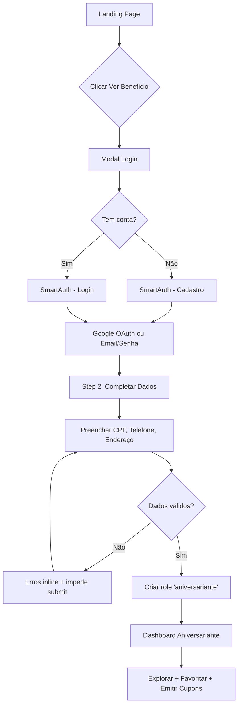
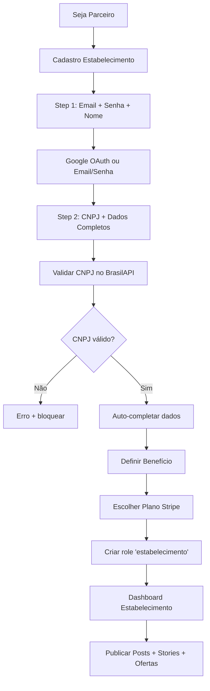

# 🧠 ARQUITETURA DO SISTEMA - ANIVERSARIANTE VIP

## 📊 Visão Geral

**Status**: Produção (Pré-Lançamento com Proteção por Senha)  
**Usuários Ativos**: 3 aniversariantes | 0 estabelecimentos (após limpeza de órfãos)  
**Posts/Stories**: 0 (aguardando geração de conteúdo)

### Stack Tecnológica

- **Frontend**: React 18 + TypeScript + Vite
- **Roteamento**: React Router v6
- **State**: React Query (TanStack Query)
- **UI**: shadcn/ui + Tailwind CSS + Framer Motion
- **Backend**: Supabase (Lovable Cloud)
  - PostgreSQL 15
  - Edge Functions (Deno)
  - Storage
  - Realtime
- **Auth**: Supabase Auth + Google OAuth
- **Pagamentos**: Stripe Connect + Webhooks
- **AI**: Lovable AI (Gemini 2.5 Flash) - Chatbot Carol
- **Email**: Resend
- **Maps**: Google Maps API + Places API
- **Analytics**: Google Analytics + Sentry
- **Deploy**: Lovable Cloud (Auto-deploy)

---

## 🗄️ BANCO DE DADOS

### Tabelas Principais (27)

| Tabela | Descrição | RLS | FKs |
|--------|-----------|-----|-----|
| **profiles** | Perfis base (nome, email, Stripe) | ✅ | auth.users |
| **aniversariantes** | Dados completos do aniversariante | ✅ | auth.users |
| **estabelecimentos** | Dados completos do estabelecimento | ✅ | auth.users |
| **user_roles** | Sistema de roles (admin, aniversariante, estabelecimento) | ✅ | auth.users |
| **cupons** | Cupons emitidos e validados | ✅ | aniversariantes, estabelecimentos |
| **cupom_rate_limit** | Rate limiting de emissão (1/semana) | ✅ | aniversariantes, estabelecimentos |
| **favoritos** | Estabelecimentos favoritados | ✅ | auth.users, estabelecimentos |
| **followers** | Seguidores de estabelecimentos | ✅ | auth.users, estabelecimentos |
| **posts** | Posts do feed social | ✅ | estabelecimentos |
| **stories** | Stories 24h | ✅ | estabelecimentos |
| **post_interactions** | Likes/comentários | ✅ | auth.users, posts |
| **post_views** | Views de posts | ✅ | posts |
| **post_shares** | Compartilhamentos | ✅ | posts |
| **flash_promos** | Ofertas relâmpago | ✅ | estabelecimentos |
| **agenda_events** | Eventos da agenda | ✅ | estabelecimentos, posts |
| **referrals** | Programa de afiliados | ✅ | auth.users, estabelecimentos |
| **estabelecimento_analytics** | Analytics de estabelecimento | ✅ | estabelecimentos |
| **navigation_logs** | Logs de navegação (Waze/Maps) | ✅ | auth.users, estabelecimentos |
| **search_analytics** | Analytics de busca | ✅ | auth.users |
| **email_analytics** | Tracking de emails | ✅ | auth.users |
| **analytics** | Analytics gerais | ✅ | auth.users |
| **security_logs** | Logs de segurança | ✅ | auth.users |
| **admin_access_logs** | Logs de acesso admin | ✅ | auth.users |
| **rate_limits** | Rate limiting global | ✅ | - |

### Views (3)

| View | Descrição |
|------|-----------|
| **public_estabelecimentos** | Estabelecimentos públicos (sem dados sensíveis) |
| **affiliate_stats** | Estatísticas do programa de afiliados |
| **expansion_insights** | Insights de expansão geográfica |

### Functions (16)

| Function | Descrição | Security |
|----------|-----------|----------|
| `has_role(_user_id, _role)` | Verifica role do usuário | SECURITY DEFINER |
| `handle_new_user()` | Trigger: Criar profile em signup | SECURITY DEFINER |
| `update_updated_at_column()` | Trigger: Atualizar updated_at | SECURITY DEFINER |
| `generate_slug(nome)` | Gerar slug único | SECURITY DEFINER |
| `generate_city_slug(cidade)` | Gerar slug de cidade | SECURITY DEFINER |
| `emit_coupon_secure()` | Emitir cupom com validações | SECURITY DEFINER |
| `generate_unique_coupon_code()` | Gerar código único | SECURITY DEFINER |
| `use_coupon(codigo, estabelecimento_id)` | Validar cupom | SECURITY DEFINER |
| `auto_generate_slug()` | Trigger: Auto-gerar slug | SECURITY DEFINER |
| `check_daily_post_limit()` | Trigger: Limitar posts/dia | SECURITY DEFINER |
| `check_daily_story_limit()` | Trigger: Limitar stories/dia | SECURITY DEFINER |
| `check_rate_limit(key, limit, window)` | Rate limiting genérico | SECURITY DEFINER |
| `get_birthday_forecast(cidade, estado)` | Forecast de aniversariantes | SECURITY DEFINER |
| `upsert_establishment_bulk(data)` | Upsert em massa | SECURITY DEFINER |

### Foreign Keys (31 implementadas)

```sql
-- Integridade referencial garantida em TODAS as tabelas
-- Cascade automático em deleções
-- Índices automáticos para performance
-- Ver detalhes em migrations/
```

### RLS Policies

**Princípio Zero Trust**: O banco não confia em ninguém por default.

#### Aniversariantes
- ✅ Leitura: Próprio perfil + Admin
- ✅ Escrita: Próprio perfil + Admin
- ✅ Deleção: Admin only

#### Estabelecimentos
- ✅ Leitura: View pública (public_estabelecimentos) + Próprio perfil + Admin
- ✅ Escrita: Próprio perfil + Admin + Colaboradores
- ✅ Deleção: Admin only

#### Cupons
- ✅ Leitura: Dono do cupom + Estabelecimento emissor
- ✅ Criação: Sistema via function
- ✅ Validação: Estabelecimento emissor

#### Posts/Stories
- ✅ Leitura: Público (todos)
- ✅ Criação: Estabelecimento dono
- ✅ Deleção: Estabelecimento dono

---

## 🛤️ ROTAS

### Públicas (sem login)

| Rota | Componente | Descrição |
|------|------------|-----------|
| `/` | Index | Landing page com hero + busca |
| `/explorar` | Explorar | Listagem com filtros + mapa |
| `/como-funciona` | ComoFunciona | Como funciona o sistema |
| `/seja-parceiro` | SejaParceito | Onboarding estabelecimentos |
| `/faq` | FAQ | Perguntas frequentes |
| `/politica-privacidade` | PoliticaPrivacidade | LGPD |
| `/termos-uso` | TermosUso | Termos de uso |
| `/:estado/:cidade/:slug` | EstabelecimentoDetalheBySlug | Detalhes por slug SEO |
| `/estabelecimento/:id` | EstabelecimentoDetalhe | Detalhes por ID (redirect) |

### Autenticação

| Rota | Componente | Descrição |
|------|------------|-----------|
| `/selecionar-perfil` | SelecionarPerfil | Escolher tipo de usuário |
| `/auth` | SmartAuth | Login/Cadastro aniversariante (Google OAuth + Email) |
| `/cadastro/estabelecimento` | CadastroEstabelecimento | Cadastro estabelecimento (2 steps) |
| `/login/estabelecimento` | LoginEstabelecimento | Login estabelecimento |
| `/forgot-password` | ForgotPassword | Recuperação de senha |
| `/reset-password` | ResetPassword | Reset senha com token |
| `/auth/callback` | AuthCallback | Callback Google OAuth |

### Protegidas - Aniversariante

**Proteção**: `ProtectedAniversarianteRoute`  
**Requisitos**: Autenticado + Role 'aniversariante' + Cadastro completo

| Rota | Componente | Descrição |
|------|------------|-----------|
| `/area-aniversariante` | AreaAniversariante | Dashboard aniversariante |
| `/meus-favoritos` | MeusFavoritos | Favoritos salvos |
| `/feed` | Feed | Feed social (posts seguidos) |
| `/ofertas` | FlashDeals | Ofertas relâmpago |
| `/cupom/:id` | CouponScreen | Detalhes do cupom |
| `/emitir-cupom` | EmitirCupom | Emitir cupom |

### Protegidas - Estabelecimento

**Proteção**: `ProtectedEstabelecimentoRoute`  
**Requisitos**: Autenticado + ID em estabelecimentos + Cadastro completo

| Rota | Componente | Descrição |
|------|------------|-----------|
| `/area-estabelecimento` | AreaEstabelecimento | Dashboard estabelecimento |

### Protegidas - Admin

**Proteção**: `ProtectedAdminRoute`  
**Requisitos**: Autenticado + Role 'admin'

| Rota | Componente | Descrição |
|------|------------|-----------|
| `/admin/dashboard` | AdminDashboard | Gestão completa (usuários, estabelecimentos, import) |
| `/setup-admin` | SetupAdmin | Setup primeiro admin |

### Redirects Legados

```
/entrar → /auth
/cadastro → /auth
/login → /auth
/registro → /auth
```

---

## 🔗 FLUXOS DE USUÁRIO

### 1️⃣ Novo Aniversariante



### 2️⃣ Novo Estabelecimento



### 3️⃣ Admin

```mermaid
graph TD
    A[/admin/dashboard] --> B{Autenticado?}
    B -->|Não| C[Redirect /login]
    B -->|Sim| D{Role admin?}
    D -->|Não| E[Erro 403]
    D -->|Sim| F[Admin Dashboard]
    F --> G[Gerenciar Usuários]
    F --> H[Gerenciar Estabelecimentos]
    F --> I[Import CSV + Fotos Google]
    F --> J[Analytics]
```

---

## 🔐 SEGURANÇA

### Camadas de Proteção (Defense in Depth)

#### 1. Frontend

- ✅ `ProtectedRoute` components
- ✅ Role checks em `useAuth`
- ✅ Loading states impedem acesso prematuro
- ✅ Redirect automático se não autorizado

#### 2. Edge Functions

- ✅ JWT verification (`verify_jwt: true`)
- ✅ Role checks via `has_role()`
- ✅ Rate limiting
- ✅ Input sanitization

#### 3. Database (PostgreSQL)

- ✅ **RLS Policies** em TODAS as tabelas sensíveis
- ✅ **Foreign Keys** garantem integridade
- ✅ **Functions SECURITY DEFINER** para operações críticas
- ✅ **Triggers** impedem ações não autorizadas

### Políticas Críticas

#### CPF/CNPJ Únicos

```sql
-- Constraint UNIQUE garante unicidade
ALTER TABLE aniversariantes ADD CONSTRAINT unique_cpf UNIQUE (cpf);
ALTER TABLE estabelecimentos ADD CONSTRAINT unique_cnpj UNIQUE (cnpj);
```

#### Rate Limiting de Cupons

```sql
-- Tabela cupom_rate_limit + trigger impedem spam
-- Máximo: 1 cupom/estabelecimento/semana
```

#### Admin-Only Operations

```sql
-- RLS policy: Apenas admin pode deletar
CREATE POLICY admin_delete ON aniversariantes
FOR DELETE USING (has_role(auth.uid(), 'admin'));
```

### Dados Sensíveis Protegidos

❌ **Nunca expostos publicamente**:
- CPF, RG, Data de Nascimento
- CNPJ, Razão Social
- Telefone, Email (exceto próprio usuário)
- Stripe IDs, Payment info
- referred_by_user_id (afiliados)

✅ **Expostos na view pública**:
- Nome Fantasia
- Logo, Fotos
- Endereço, Horários
- Categoria, Benefício

---

## ⚙️ COMPONENTES CRÍTICOS

### Proteção de Rotas

#### `ProtectedAniversarianteRoute.tsx`

```typescript
// Verifica:
// 1. Sessão ativa
// 2. Role 'aniversariante' existe
// 3. Registro aniversariante existe
// 4. cadastro_completo === true
// Se falhar: redirect /auth
```

#### `ProtectedEstabelecimentoRoute.tsx`

```typescript
// Verifica:
// 1. Sessão ativa
// 2. Registro estabelecimento existe (id === auth.uid)
// 3. cadastro_completo === true
// Se falhar: redirect /cadastro/estabelecimento
```

#### `ProtectedAdminRoute.tsx`

```typescript
// Verifica:
// 1. Sessão ativa
// 2. Role 'admin' existe
// Se falhar: redirect / com erro 403
```

#### `PasswordProtection.tsx` (Pré-Lançamento)

```typescript
// Senha: 'aniversariante2025'
// Token localStorage com 24h expiration
// Remover antes do lançamento público
```

### Hooks Essenciais

#### Autenticação

- `useAuth` - Session + user + roles
- `useSession` - Session state
- `useUser` - User profile data

#### Dados

- `useEstabelecimentos(filters)` - Listar estabelecimentos com filtros
- `useFavoritos(userId)` - Favoritos do usuário
- `useCupons(aniversarianteId)` - Cupons do usuário
- `usePosts(establishmentId)` - Posts do estabelecimento
- `useStories(establishmentId)` - Stories ativos
- `useFlashPromos(cidade, estado)` - Ofertas relâmpago

#### Analytics

- `useAnalytics()` - Track eventos
- `useEstabelecimentoAnalytics(id)` - Analytics do estabelecimento
- `useNavigationMetrics()` - Métricas de navegação

#### Utilidades

- `useGeolocation()` - Geolocalização
- `useCepLookup()` - Busca CEP (BrasilAPI/ViaCEP)
- `useDebounce(value, delay)` - Debounce inputs
- `useCidadesAutocomplete()` - IBGE API cities

---

## 🔌 EDGE FUNCTIONS (33)

### Públicas (verify_jwt: false)

| Function | Descrição | Trigger |
|----------|-----------|---------|
| `carol-chat` | Chatbot Carol (Gemini AI) | Manual |
| `chat-assistant` | Assistente proativo formulários | Manual |
| `fetch-business-hours` | Buscar horários Google Places | Manual |
| `update-all-business-hours` | Atualizar horários em massa | Cron |
| `geocode-address` | Geocoding Google Maps | Manual |
| `reverse-geocode` | Reverse geocoding | Manual |
| `get-active-cities` | Cidades com estabelecimentos | Manual |
| `get-expansion-insights` | Insights expansão | Manual |
| `send-recovery-email` | Email recuperação senha | Auth event |
| `send-welcome-email` | Email boas-vindas | Auth event |
| `send-birthday-reminder` | Email lembretes aniversário | Cron |
| `emit-coupon` | Emitir cupom | Manual |
| `validate-coupon` | Validar cupom | Manual |
| `stripe-webhook` | Webhooks Stripe | Stripe |
| `standardize-text` | Normalizar textos | Manual |
| `fetch-place-photo` | Buscar fotos Google Places | Manual |

### Protegidas (verify_jwt: true)

| Function | Descrição | Auth |
|----------|-----------|------|
| `submit-establishment-data` | Submit dados estabelecimento | JWT |
| `cleanup-orphan-users` | Limpar usuários órfãos | JWT + Admin |
| `delete-user` | Deletar usuário completo | JWT + Admin |
| `check-auth-rate-limit` | Rate limit auth | JWT |
| `setup-first-admin` | Setup primeiro admin | Special |
| `check-subscription` | Verificar assinatura Stripe | JWT |
| `create-checkout` | Checkout Stripe | JWT |
| `create-referral-checkout` | Checkout afiliado | JWT |
| `customer-portal` | Portal Stripe | JWT |
| `stripe-connect-onboarding` | Onboarding Stripe Connect | JWT |
| `release-held-commissions` | Liberar comissões | Cron |
| `notify-new-establishments` | Notificar novos estabelecimentos | Cron |
| `track-email-open` | Track abertura email | Manual |
| `track-email-click` | Track cliques email | Manual |

**⚠️ ATENÇÃO**: Várias functions não estão configuradas em `supabase/config.toml` e podem falhar!

---

## 🌐 INTEGRAÇÕES EXTERNAS

### Status das Integrações

| Serviço | Status | Variável Ambiente | Observações |
|---------|--------|-------------------|-------------|
| **Google OAuth** | ✅ | `GOOGLE_CLIENT_ID`, `GOOGLE_CLIENT_SECRET` | Configurado + Funcionando |
| **Google Maps API** | ✅ | `VITE_GOOGLE_MAPS_API_KEY` | Mapas + Geocoding + Places |
| **Lovable AI** | ✅ | `LOVABLE_API_KEY` | Carol chatbot (Gemini 2.5 Flash) |
| **Resend** | ✅ | `RESEND_API_KEY` | Emails transacionais |
| **Stripe** | ✅ | `STRIPE_SECRET_KEY`, `STRIPE_WEBHOOK_SECRET` | Pagamentos + Afiliados |
| **Sentry** | ✅ | `VITE_SENTRY_DSN` | Error tracking |
| **Google Analytics** | ✅ | `VITE_GA_MEASUREMENT_ID` | Analytics |

### APIs Brasileiras

| API | Uso | Cache |
|-----|-----|-------|
| **BrasilAPI** | CEP lookup + CNPJ validation | 24h localStorage |
| **ViaCEP** | CEP fallback | 24h localStorage |
| **IBGE** | Cidades autocomplete | 24h localStorage |

---

## ⚠️ PROBLEMAS CONHECIDOS

### 🔴 CRÍTICO

| # | Problema | Impacto | Status |
|---|----------|---------|--------|
| 1 | ~~Ausência de Foreign Keys~~ | ~~Integridade de dados comprometida~~ | ✅ **RESOLVIDO** |
| 2 | Edge Functions não configuradas | Falhas silenciosas | 🔧 Pendente |
| 3 | PasswordProtection ativa | Bloqueia acesso público | 🔧 Remover no lançamento |
| 4 | Estabelecimentos órfãos deletados | 0 estabelecimentos ativos | 🔧 Re-importar |

### 🟡 MÉDIA

| # | Problema | Impacto | Status |
|---|----------|---------|--------|
| 5 | Ausência de posts/stories | Feed vazio | 🔧 Criar conteúdo demo |
| 6 | Ausência de tabela admins | Admin via roles apenas | 🔧 Considerar criar |

### 🟢 BAIXA

| # | Problema | Impacto | Status |
|---|----------|---------|--------|
| 7 | Mapbox removido mas pode ter resíduos | Código morto potencial | ✅ Verificado |
| 8 | Alguns hooks não utilizados | Bundle size | ℹ️ Monitorar |

---

## 🔧 CORREÇÕES PRIORITÁRIAS

### P1 (Bloqueador de Lançamento)

- [ ] Configurar TODAS as Edge Functions em `supabase/config.toml`
- [ ] Remover `PasswordProtection` antes do lançamento
- [ ] Re-importar estabelecimentos via fluxo correto (com auth)
- [ ] Criar posts/stories demo para estabelecimentos
- [ ] Testar fluxo completo end-to-end

### P2 (Alta Prioridade)

- [ ] Criar script de backup automático
- [ ] Implementar monitoramento de uptime
- [ ] Criar dashboard de métricas em tempo real
- [ ] Implementar rate limiting global
- [ ] Adicionar testes E2E (Playwright)

### P3 (Médio Prazo)

- [ ] Otimizar queries N+1
- [ ] Implementar cache Redis
- [ ] CDN para imagens
- [ ] Compressão de assets
- [ ] Lazy loading de componentes

---

## 📝 RECOMENDAÇÕES

### Segurança

1. ✅ **Auditar RLS policies** - Garantir que nenhuma tabela sensível está exposta
2. ✅ **Foreign Keys** - IMPLEMENTADAS! Integridade garantida
3. 🔧 **Backup automático** - Implementar rotina diária
4. 🔧 **Rate limiting** - Expandir para todas as APIs críticas
5. 🔧 **Penetration testing** - Contratar auditoria externa

### Performance

1. 🔧 **CDN para assets** - Reduzir latência de imagens
2. 🔧 **Query optimization** - Revisar queries lentas
3. 🔧 **Cache layer** - Implementar Redis para hot data
4. 🔧 **Image optimization** - Compressão automática no upload
5. ✅ **Índices** - CRIADOS automaticamente com FKs

### Escalabilidade

1. 🔧 **Sharding geográfico** - Separar por estado quando necessário
2. 🔧 **Read replicas** - Para queries pesadas
3. 🔧 **Queue system** - Bull/BullMQ para jobs assíncronos
4. 🔧 **Microservices** - Considerar separar serviços críticos
5. ✅ **Connection pooling** - Já configurado no Supabase

### Observabilidade

1. ✅ **Sentry** - Error tracking ativo
2. ✅ **Google Analytics** - Analytics básico
3. 🔧 **APM** - Implementar Application Performance Monitoring
4. 🔧 **Logging** - Centralizar logs (Logtail/DataDog)
5. 🔧 **Alerting** - PagerDuty/Opsgenie para incidentes

---

## 📊 MÉTRICAS ATUAIS

**Última atualização**: 30/11/2025

### Usuários

- **Aniversariantes**: 3 registrados, 0 cupons emitidos
- **Estabelecimentos**: 0 ativos (após limpeza)
- **Admins**: 1 ativo

### Conteúdo

- **Posts**: 0
- **Stories**: 0
- **Cupons**: 0
- **Flash Promos**: 0

### Performance

- **Build Time**: ~45s
- **Bundle Size**: ~2.8MB (não otimizado)
- **Lighthouse Score**: Não medido

---

## 🚀 PRÓXIMOS PASSOS

### Pré-Lançamento (Fase Atual)

1. ✅ Adicionar Foreign Keys (CONCLUÍDO)
2. 🔧 Configurar Edge Functions faltantes
3. 🔧 Re-importar estabelecimentos com auth
4. 🔧 Criar conteúdo demo (posts/stories)
5. 🔧 Remover PasswordProtection
6. 🔧 Testar fluxo completo

### Lançamento Soft (Semana 1)

1. 🔧 Abrir para primeiros 100 usuários beta
2. 🔧 Monitorar erros e performance
3. 🔧 Coletar feedback
4. 🔧 Iterar rapidamente

### Expansão (Semana 2-4)

1. 🔧 Campanha de marketing local (Florianópolis)
2. 🔧 Onboarding de estabelecimentos chave
3. 🔧 Programa de embaixadores
4. 🔧 Expansão para outras cidades de SC

---

## 📞 SUPORTE

**Documentação**:
- Este arquivo (`ARCHITECTURE.md`)
- `/README.md` - Overview do projeto
- `/TESTING.md` - Guia de testes
- `/SECURITY.md` - Segurança
- `/docs/` - Documentação adicional

**Logs e Debugging**:
- Supabase Dashboard: Logs de Edge Functions, DB, Auth
- Sentry: Error tracking
- Google Analytics: User behavior

---

**Última revisão**: 30 de Novembro de 2025  
**Autor**: Sistema Lovable AI  
**Versão**: 1.0.0
